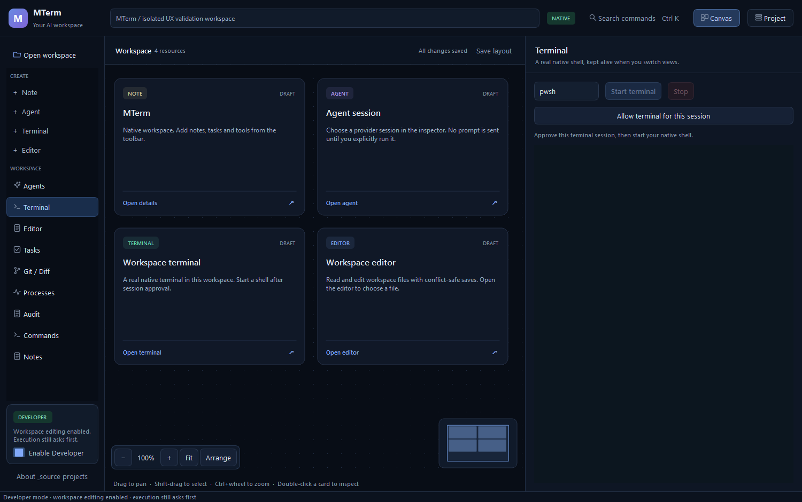

# MTerm

A native-first AI workspace with a familiar spatial workbench: canvas, project view, persistent
inspectors, keyboard-first commands, and a real native terminal. Formerly AstraCommander.

**Active development: `C:\Tools\Dev\MTerm`. C++20 / Qt 6. Experimental, not 100% feature-complete.**



This is the running Qt application, not an Electron screenshot or design mockup. The pictured
resources are a labeled test fixture. No browser engine or Node runtime is required by the native app.

## Run

```powershell
cd C:\Tools\Dev\MTerm
.\Start-MTerm.ps1
```

The development launcher opens this checkout by default. Use `-Workspace PATH` for another root,
or `-UseLastWorkspace` to restore the app's saved workspace. Existing user databases are not moved
or imported automatically. Previous Documents checkouts remain recovery snapshots.

For a fresh development machine:

```powershell
.\scripts\native\Bootstrap-Windows.ps1
.\scripts\native\Build.ps1 -Configuration Release
.\scripts\native\Build.ps1 -Configuration Debug
```

Project-local initial pins: Qt 6.8.3, MinGW 13.1.0. These are reproducibility pins, not security
approval or a claim to be the latest versions. The native staging script and smoke helper are in
`scripts/native/`; staging remains unsigned and subject to redistribution/license review.

## Native UX restored

Left Create/Inspect navigation, top workspace bar, a persistent center canvas, resizable right
inspector and Canvas/Project switch. Native resource cards and the Project view use the same IDs.
Inspectors load once on first use and stay alive; navigation does not restart terminals or clear
editor contents. Notes/layouts save with visible status. File selection, safe editing, command
palette, pan/zoom/minimap, readable Arrange, pin/collapse and existing-edge rendering are implemented.

The core/native services remain isolated from presentation. Security grants, scoped file/version
checks, SQLite, captured commands, read-only Git, native inventory and ConPTY/libvterm are preserved.
Independent per-node live sessions, richer task/evidence, native Git mutation and MCP/provider parity
remain backlog items. This redesign does not claim every reference interaction is already native.

## Contributor entry point — every AI provider and human

Read [AGENTS](AGENTS.md), [CONTRIBUTING](CONTRIBUTING.md), [HANDOFF](docs/HANDOFF.md),
[STATUS](docs/STATUS.md), [UI contract](docs/UI_DESIGN_CONTRACT.md), and [source-project matrix](docs/SOURCE_PROJECT_FEATURE_MATRIX.md).
The full unchanged master backlog is also indexed as [485 requirements](docs/backlog/requirements-index.json).
Use the [feature/UI template](docs/templates/FEATURE_UI_PARITY_TEMPLATE.md) rather than dropping
requirements between conversations. AI identity, UTC dates, files, tests and limitations belong in
`docs/ai/changes/`, source headers and commit trailers; historic attribution is retained.

## DevFleet direction

MTerm is intended to become a primary DevFleet interface. The proposed versioned, permission-scoped
adapter contract is [here](docs/DEVFLEET_INTERFACE_VISION.md). **No live DevFleet integration is
implemented or implied by this UI pass.** MTerm remains usable independently.

## Verification and limits

Windows native Release/Debug run six CTest suites, including original service/PTY regressions and
new UI/continuity/500-card/lazy-inspector checks. The Electron reference separately passes its
relocated typecheck/lint/59-unit/build/MCP/2-E2E gate. [Current evidence](docs/validation/2026-09-22-native-ux.md).

The redesigned local package is about 32.5 MB. Its five-run inside-main first-paint median was
87 ms after profiling and lazy inspector construction; this is not an external launch or CLI
comparison. CPU/frame/memory behavior under real multi-agent soak workloads remains to certify.
No paid model was invoked. CI activation is still blocked by the previously documented GitHub
workflow-write permission; the non-executable recipe remains in docs/ci/.

MTerm code is MIT. Source-inspired features are documented, not blindly copied. Third-party code,
Qt and compiler runtimes retain their own licenses; see [THIRD_PARTY](docs/THIRD_PARTY.md).
